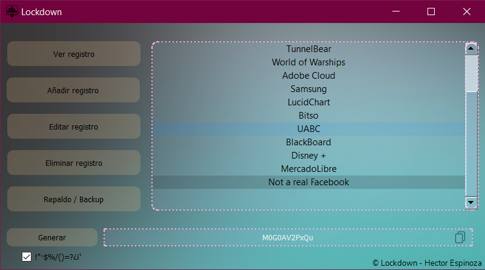

# Lockdown

> Keep your data safe and locked away

 

Lockdown es el sucesor espiritual de Padlock, el primer administrador de contraseñas que hice.



## Instalación

### Instalar requerimientos

```sh
pip install -r requirements.txt
```

### Instalar base de datos


Debes de correr el archivo install.py de la siguiente manera:

```sh
install.py
```

Se abrirá un menú dónde podrá elegir si:

1. restaurar una base de datos mediante su archivo .lockdown
2. hacer una instalación limpia

## Que tan seguro es?

Lockdown utiliza el metodo de encriptado Fernet, el cual es un metodo de encriptado simetrico, por lo que tus contraseñas están seguras.


Y asi está el texto en la base de datos


## Olvidaste tu contraseña?

No te preocupes, al instalar la base de datos, se te genera una clave mnemotécnica para utilizar en caso de un recovery necesario.
Para acceder a la funcion de recovery deberás seleccionar Opciones en la ventana del login y seguir las instrucciones.

## Tienes un backup que quieres restaurar?

Al igual que en la recuperación de la contraseña, seleccionaras "Opciones" en la ventana de login para seguir las instrucciones.

## Actualizaciones

### v1.0 (31/12/2020)

- Primer version

### V1.5 (3/01/2021)

- Instalación mediante GUI

## Licencia

[](https://www.gnu.org/licenses/gpl-3.0)

- Copyright 2020 © Eptor.

## Donaciones

Cualquier cantidad es infinitamente agradecida ❤

- Paypal: [Hector Espinoza](http://www.paypal.me/espinoza7854)

- Bitcoin: 3MaZtzzJSY2Pw6v3WMu5qvzyaFstPKUX2J

- Monero: 47egPTVGs3Eiq7gPYEmw6zat8dqLL8phYK61Hud937tvRbusGfd2TmUZW8eag6jb38Q3bQyKUns13SKjwHhPV4fXMnNCxxF


## Creditos

- Imagen blurr: [ianbarnard.co.uk](http://www.ianbarnard.co.uk/wp-content/uploads/2013/09/free-blurred-web-backgrounds-09.jpg)
- Icono sacado de: [iconscout](https://iconscout.com/icon/lockdown-2318925), fue creado por [Nithinan Tatah](https://iconscout.com/contributors/nithinan-tatah)
- Icono copiar: [iconscout](https://iconscout.com/icon/copy-197)
- Icono refresh: [iconscout](https://iconscout.com/icon/refresh-reload-recycle-synchronize-retry)
